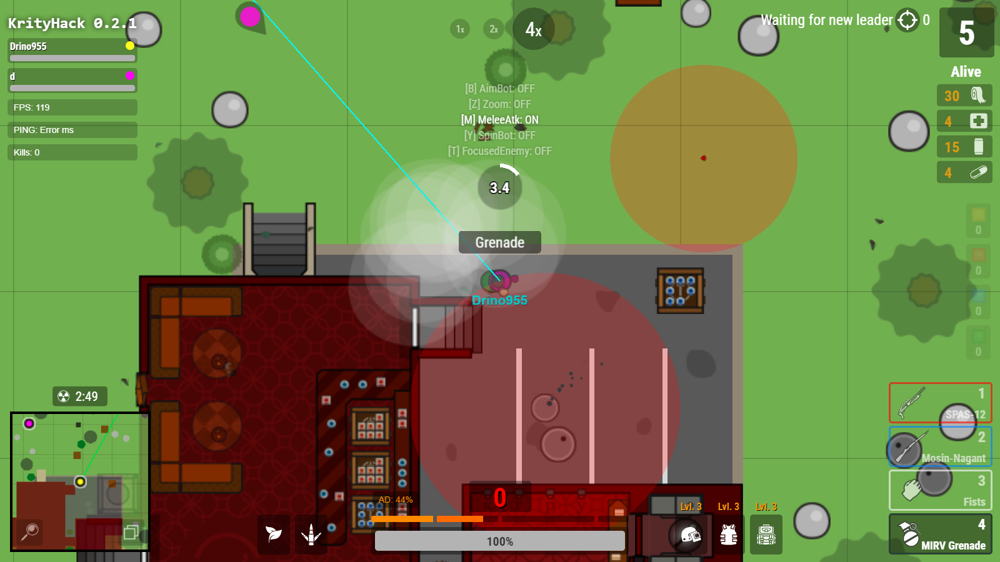

# Survev-Krityhack 🎯

**Survev-Krityhack** is a cheat tool designed to enhance gameplay in the game survev.io/resurviv.biz by providing various hacks and modifications.

## Features ✨
- 🏠 **X-Ray (No Ceilings)**: Removes ceilings from buildings, allowing you to see inside.
- 🔫 **BumpFire**: Allows continuous shooting without constant clicking.
- 🔍 **Enhanced game zoom**.
- 🌫️ **Smoke opacity**.
- 🧱 **Obstacle opacity**.
- 🏷️ **Player names will be visible**.
- 👁️ **ESP Features**: Some ESP features can be disabled by changing their values in the code (e.g., `let laserDrawerEnabled = true;`).
    - 🔫 **Tracer**: Draws lines to nearby players.
    - 💣 **NadeObstacles**: Highlights dangerous objects that are about to explode.
    - 🔦 **Flashlight**: Highlights the direction the enemy's weapon is pointing and its damage radius.
- 🛠️ **Auto Loot**: Automatically picks up nearby items to streamline gameplay.
- 🚪 **Auto Door Open**: Automatically opens doors when you approach them.
- 🎯 **Aimbot**: Automatically targets the nearest player with precision and prediction (aimbot from IceHack).
- 👥 **Add to Friends**: By clicking the middle mouse button, you can add a player to friends. AimBot will not target them, green lines will go to them, and their name will turn green.
- 🖥️ **AlguienClient UI**: A user-friendly interface for survev.io.
    - 📊 **Ping, FPS, Kills, Health, and Adrenaline Display**: Shows real-time ping, frames per second, number of kills, health percentage, and adrenaline percentage on the screen.
    - 🛡️ **Weapon Highlighting**: Highlights the currently selected weapon for better visibility.
    - 🔄 **Movement Interpolation and Smoothing**: Adds interpolation and smoothing to player movements for a more fluid gameplay experience.
- 🗺️ **Map Coloring**: The map is color-coded (e.g., white circle for mosin-tree, gold container for SV98, blue circle for rock cache, yellow bunker for storm bunker, pink square for hardstone...)
- 🥋 **AutoMelee**: Automatically moves towards and attacks enemies when they are within a certain distance (4 game coordinates for ranged weapons, 8 game coordinates for melee weapons) while holding down the left mouse button.
- 🔄 **AutoSwitch**: Quickly switches weapons to avoid cooldown after shooting.
- 🎯 **FocusedEnemy**: Press [T] to focus on an enemy. AimBot will continuously target the focused enemy. Press [T] again to reset.
- ⏲️ **GrenadeTimer**: Shows a timer for when a grenade will explode.

## Installation 📥
1. Install the Tampermonkey Legacy (MV2) extension for your browser from the [official website](https://www.tampermonkey.net/).
YOU NEED "Tampermonkey Legacy (MV2)"!!!!!!!!!!!!!!!!!!!!!!!! NOT "Tampermonkey"
2. Install script from [click](https://raw.githubusercontent.com/Drino955/survev-krityhack/main/krityhack.user.js).
3. Refresh the survev.io/resurviv.biz page to activate the hack.

## Usage 🚀
1. Launch survev.io/resurviv.biz in your browser.
2. Run the hack executable.
3. Enjoy the enhanced gameplay!

## Disclaimer ⚠️
This software is for educational purposes only. Use at your own risk.

## Special Thanks 🙌
Special thanks to zertalious for the [surviv.io Aimbot, ESP, X-Ray script](https://greasyfork.org/en/scripts/439241-surviv-io-aimbot-esp-x-ray) and his article on [how the Shellshock.io cheat was made](https://www.zertalious.xyz/how-was-the-shellshock-io-cheat-made/).
Also, thanks to my friend Askile for help with TamperMonkey and the IceHack team [IceHack](https://github.com/humphreygaming/surviv-cheat-source).
Thanks to SoyAlguien0 for the [AlguienClient-Survev.io_Client UI client](https://github.com/SoyAlguien0/AlguienClient-Survev.io_Client).

## A Special Note 📝

A huge, sarcastic thank you to [ioman](https://github.com/IOMAN1) for calling me an idiot who has never written a single line of code. That's exactly why I'm releasing the source code of this cheat and keeping it open, to highlight just how utterly helpless and noob the game developers truly are. By the way, ioman only made a couple of crappy commits to the [repository](https://github.com/leia-uwu/survev), while the real developer Leia ([leia-uwu](https://github.com/leia-uwu)) did almost all the work.

## Community 🌐
Join our Telegram group for updates and support: [KrityTeam](https://t.me/krityteam/)
Join our Discord community for discussions and support: [[HACK] League of Hackers](https://discord.gg/wPuvEySg3E)

## License 📄
This project is licensed under the GPLv3 License - see the [LICENSE](LICENSE) file for details.
